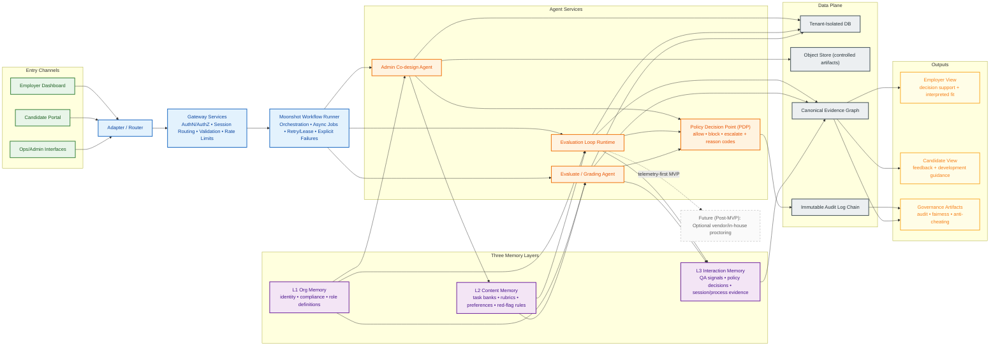

# Moonshot High-Level Architecture

## Purpose and Scope
Moonshot is a multi-tenant assessment platform with human-in-the-loop co-design, candidate evaluation runtime, and auditable grading. This document is the high-level architecture source for product and engineering alignment.

This file is strategic and system-level. It defines operating boundaries, responsibility split, and MVP direction while linking to detailed implementation specifications.

## Architecture Principles
- Multi-tenant isolation by default, with explicit tenant-scoped authorization and data boundaries.
- Human-in-the-loop control at all high-impact checkpoints (content publication, policy-sensitive actions, adjudication).
- Evidence-first design: operational events, scoring evidence, and governance lineage are first-class outputs.
- No fallback routes: explicit error handling and diagnosable failures are required.
- Stable scoring core with flexible interpretation layer.
- Versioned contracts and provenance for every decision path.
- Prefer structured, auditable memory over opaque optimization in MVP.

## System Topology
Canonical flow:

`Entry Channels -> Adapter/Router -> Gateway Services -> Moonshot Workflow Runner -> Agent Services + Data Plane -> Outputs`

### Entry Channels
- Employer dashboard
- Candidate portal
- Ops/admin interfaces

### Adapter/Router
- Normalizes channel-specific requests and payload formats.
- Applies integration-specific transformation without changing core business semantics.
- Forwards typed requests into gateway services.

### Gateway Services
- Tenant AuthN/AuthZ and role checks
- Session routing and request identity
- Validation and rate limiting
- API contract conformance and explicit error envelopes

### Moonshot Workflow Runner
- Orchestration across the three agent loops
- Async job execution with retries and queue/lease lifecycle
- Explicit failure handling with actionable diagnostics (no fallback behavior)
- Workflow state transitions and checkpoint enforcement

### Agent Services + Data Plane
- Agent services:
  - Admin Co-design Agent
  - Evaluation Loop runtime services
  - Evaluate/Grading Agent
- Data plane:
  - Tenant-isolated operational database
  - Object storage for controlled artifacts
  - Event telemetry and session evidence
  - Immutable audit log chain

### Outputs
- Employer-facing decision support views
- Candidate-facing feedback and development views
- Governance artifacts (audit, fairness, anti-cheating signals, provenance)

## Architecture Diagram (Mermaid)

## Three Agent Loops

### 1) Admin Co-design Agent
Objective:
Build and continuously improve employer-aligned `TaskFamily` and `Rubric` artifacts.

Primary users:
- Org admins
- Reviewers

Inputs:
- Org context and role constraints
- Existing task banks/rubrics/preferences/red-flag rules
- Historical quality and acceptance signals

Outputs:
- Draft and approved `TaskFamily` variants
- Versioned `Rubric` artifacts
- Quality diagnostics and mutation analysis

Required human checkpoints:
- Review/edit/accept before publish
- Policy-sensitive content escalation

Audit artifacts:
- Content review decisions
- Version lineage and change rationale
- Quality evaluation outcomes

### 2) Evaluation Loop
Objective:
Deliver assessment context/tasks to candidates, monitor process evidence, and collect final submission.

Primary users:
- Candidates
- Proctors/reviewers (adjudication path)

Inputs:
- Published `TaskFamily` and associated `Rubric` constraints
- Session policy and mode
- Runtime policy decisions

Outputs:
- Session events and process evidence
- Candidate submission payload
- Risk signals for adjudication (separate from competency score)

Required human checkpoints:
- Manual review for high-risk anti-cheating patterns
- Follow-up adjudication where policy requires

Audit artifacts:
- Session event timeline
- Policy decisions and decision codes
- Submission and review trail

### 3) Evaluate/Grading Agent
Objective:
Generate auditable grading and interpretation using rule-driven logic, error context, and LLM analysis.

Primary users:
- Reviewers
- Hiring teams
- Candidate-facing feedback consumers

Inputs:
- Candidate submission
- Session evidence graph
- `Rubric`, scoring configuration, policy context

Outputs:
- `ScoreResult` with deterministic triggers and confidence metadata
- Interpretation/report views for employer and candidate
- Follow-up recommendations and reviewer comment paths

Required human checkpoints:
- Review queue when confidence/policy triggers fire
- Admin/reviewer follow-up and override workflow (where allowed)

Audit artifacts:
- Scoring provenance (`task_family_version`, `rubric_version`, `scorer_version`, `model_hash`)
- Trigger-code lineage from evidence to score outcome
- Report generation trace

## Three Memory Layers

### Layer 1: Org-level Memory
Scope:
Organization identity, role/compliance policies, business/system context, and role definitions.

Characteristics:
- Low write frequency
- High governance and approval requirements
- Strong tenant and role visibility controls

### Layer 2: Content Memory
Scope:
Task banks, rubrics, preferences, and red-flag rules.

Characteristics:
- Medium write frequency through co-design loop
- Versioned and review-gated before active use
- Primary source for generation and evaluation context

### Layer 3: Interaction/Observation Memory
Scope:
QA signals, policy decisions, observer/process/session evidence.

Characteristics:
- High write frequency during live sessions
- Evidence-oriented, append-heavy
- Feeds anti-cheating adjudication, scoring triggers, and interpretation

### Memory Read/Write Matrix by Loop

| Loop | Reads Layer 1 (Org) | Writes Layer 1 (Org) | Reads Layer 2 (Content) | Writes Layer 2 (Content) | Reads Layer 3 (Interaction) | Writes Layer 3 (Interaction) |
| --- | --- | --- | --- | --- | --- | --- |
| Admin Co-design Agent | Yes | Limited (policy/admin approved) | Yes | Yes (review-gated) | Aggregated only | Limited (quality signals) |
| Evaluation Loop | Yes (policy/mode) | No | Yes (published artifacts) | No | Yes | Yes (session/process evidence) |
| Evaluate/Grading Agent | Yes (policy constraints) | No | Yes | No | Yes | Yes (scoring/interpretation traces) |

## Governance, Security, and Audit
- Tenant isolation and role-based authorization are mandatory at every boundary.
- Policy-sensitive decisions use explicit allow/block/escalate outcomes with machine-readable reason codes.
- Audit logs are immutable and hash-chain verifiable.
- Every score and interpretation includes provenance and version locks.
- Context/memory writes track source origin (`admin_approved` vs `model_inferred`) and actor role.
- Derived telemetry is default; raw data retention is explicit-policy opt-in with TTL and purgeability.

## Integrated Architecture Decisions

### 1) Policy Decision Point (PDP)
All loops call a shared PDP boundary for policy decisions:
- Decision types: `allow`, `block`, `escalate`
- Required outputs: reason code, policy version, decision metadata
- Purpose: consistent enforcement, observability, and governance traceability

### 2) Memory Lifecycle and Provenance
All memory entries follow:

`proposed -> reviewed -> approved -> active -> deprecated`

Required provenance fields:
- `tenant_id`
- `memory_layer`
- `source_type` (`admin_approved` or `model_inferred`)
- `created_by` / `reviewed_by`
- `policy_version`
- `timestamps` and change reason

### 3) Canonical Evidence Graph per Session
- One canonical evidence graph is the source of truth for session process and outcomes.
- Two output projections are rendered from the same graph:
  - Employer view (decision support and rubric-aligned analysis)
  - Candidate view (developmental feedback and guidance)

### 4) Risk-Signal and Competency Separation
- Anti-cheating and policy risk signals remain separate from competency scoring.
- Combination happens only in interpretation/reporting with explicit caveats and traceable rationale.

## Anti-Cheating Architecture (MVP vs Future)

### MVP Scope (Telemetry-First)
Detection signals:
- Focus/blur events
- Copy/paste events
- Timing anomalies
- Verification-evidence patterns

MVP adjudication:
- Automated detection creates review flags
- Human adjudication resolves high-risk cases
- Adjudication outcomes are auditable and retained with session evidence

### Explicitly Deferred (Unless Third-Party Integration)
- In-house lockdown browser stack
- Full in-house camera/audio proctoring pipeline
- Native app controls for OS-level application lockdown

### Detection vs Adjudication Split
- Detection is automated, signal-driven, and non-final.
- Adjudication is policy-governed and human-review accountable.
- Final outcomes must include decision codes and evidence references.

## Scoring and Reporting Model
- Keep stable scoring engine + flexible interpretation engine.
- Scoring is deterministic/evidence-linked where possible; interpretation is non-mutating and view-specific.
- “Fit score” is a derived interpretation artifact, not the sole decision primitive.
- Reporting must show trigger-code transparency and full provenance metadata.
- Confidence and review triggers remain explicit in outputs to avoid opaque decisions.

## MVP Goals
1. Deliver all three loop foundations in one product path:
   - Admin Co-design
   - Evaluation runtime
   - Evaluate/Grading
2. Keep Interview Agent MVP-critical, starting with text + rubric mode.
3. Ship dual first-class outputs:
   - Employer decision-support output
   - Candidate feedback output
4. Run content-learning loop on practical reward:
   - Admin quality rating + reuse/publish outcomes
5. Defer embeddings by default in MVP unless retrieval scale requires them.

### MVP Acceptance Targets (High-Level)
- Coverage:
  - End-to-end flow for co-design -> evaluation -> grading/reporting is operational for pilot use.
- Latency/throughput:
  - Synchronous user-facing endpoints maintain responsive p95 behavior for pilot load.
  - Async generation/scoring jobs complete within pilot-operational windows with retry diagnostics.
- Auditability:
  - Each submitted session has traceable evidence, scoring provenance, and policy/audit linkage.
- Operability:
  - Worker health, queue lease visibility, and explicit error diagnostics are available.

## MVP Non-Goals
- End-to-end RL policy optimization.
- In-house full proctoring stack (lockdown + live camera/audio).
- Embedding-heavy memory architecture as a default requirement.

## Phased Evolution After MVP

### Phase 1
- Telemetry-first anti-cheating architecture
- Text-first interview mode with rubric-driven evaluation
- Governed content loop with admin-centered reward signals

### Phase 2
- Richer interview modalities (for example, controlled voice workflows)
- Optional stronger proctoring path (prefer vendor integration first)
- Selective retrieval expansion if data scale warrants it

### Phase 3
- Selective optimization loops under governance constraints
- Deeper adaptation of content routing/sequence based on validated reward signals
- Continued auditability and policy-control guarantees

## Public APIs / Interfaces / Types Impact (This Doc Task)
- No immediate runtime API changes in this task (documentation only).
- Clarified interface contracts in prose:
  - Loop ownership boundaries (co-design/evaluation/grading)
  - Memory write-state contract (`proposed/reviewed/approved/active/deprecated`)
  - Risk-signal vs competency-score semantics
- Future API candidates are proposed only and not committed by this document.

## Traceability Links to Existing Docs
- [MVP Scope](docs/00_mvp/mvp_scope.md)
- [ADR 0002: Agent Topology and Shared Context](docs/01_arch/adr_0002_agent_topology.md)
- [ADR 0003: AuthN/AuthZ Baseline](docs/01_arch/adr_0003_authz_model.md)
- [ADR 0007: Content Learning Loop (RL-Lite)](docs/01_arch/adr_0007_content_learning_loop.md)
- [Domain Model](docs/02_domain/domain_model.md)
- [Scoring and Interpretation Spec](docs/05_scoring/scoring_spec.md)
- [Event Schema](docs/04_events/event_schema.md)
- [Security, Privacy, and Governance Controls](docs/06_security/privacy_and_controls.md)
- [Frontend/Backend Contract](docs/08_frontend_contract/frontend_backend_contract.md)

## Verification Checklist (Doc Task)
- [x] `architecture.md` exists at repository root and is self-contained.
- [x] Required sections are present, including a dedicated `MVP Goals` top-level section.
- [x] Terminology is consistent with current docs (`TaskFamily`, `Rubric`, `Session`, `ScoreResult`, provenance).
- [x] Architecture decisions are explicit: PDP boundary, memory lifecycle, dual-view evidence model, telemetry-first anti-cheating.
